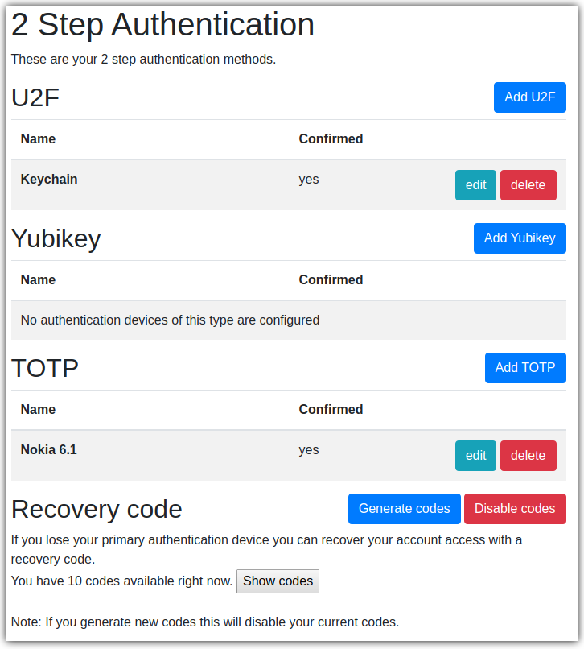

=============================================
|KLEIDES| Kleides Multi Factor Authentication
=============================================

.. image:: https://img.shields.io/pypi/v/kleides_mfa.svg
        :target: https://pypi.python.org/pypi/kleides_mfa

.. image:: https://travis-ci.org/ossobv/kleides-mfa.svg
        :target: https://travis-ci.org/ossobv/kleides-mfa
        :alt: Continuous Integration Status

.. image:: https://readthedocs.org/projects/kleides-mfa/badge/?version=latest
        :target: https://kleides-mfa.readthedocs.io/en/latest/?badge=latest
        :alt: Documentation Status

Kleides MFA provides a convenient interface to configure, manage and
authenticate with multi factor authentication for `django-otp`_ plugins.
Currently supported plugins are:

* Static devices included in django-otp.
* TOTP devices included in django-otp.
* Yubikey devices using `django-otp-yubikey`_.
* U2F devices using `django-otp-u2f`_.

.. _django-otp: https://github.com/django-otp/django-otp
.. _django-otp-yubikey: https://github.com/django-otp/django-otp-yubikey
.. _django-otp-u2f: https://github.com/ossobv/django-otp-u2f

* Free software: GNU General Public License v3
* Documentation: https://kleides-mfa.readthedocs.io.

Install
-------

.. code-block::

   pip install kleides-mfa

Add `kleides_mfa` to your `INSTALLED_APPS` with your preferred
django-otp plugins::

   INSTALLED_APPS = [
       ...
       'django_otp',
       'django_otp.plugins.otp_static',
       'django_otp.plugins.otp_totp',
       'kleides_mfa',
       ...
   ]

Add `kleides_mfa.middleware.KleidesAuthenticationMiddleware` to the
`MIDDLEWARE` setting after the Django AuthenticationMiddleware::

   MIDDLEWARE = [
       ...
       'django.contrib.auth.middleware.AuthenticationMiddleware',
       'kleides_mfa.middleware.KleidesAuthenticationMiddleware',
       ...
   ]

Do not use `django_otp.middleware.OTPMiddleware` with Kleides MFA as it
will not be able to load the OTP device.

Set the LOGIN_URL::

    LOGIN_URL = 'kleides_mfa:login'

Include `kleides_mfa.urls` in your urlpatterns::

   urlpatterns = [
       path('', include('kleides_mfa.urls')),
   ]

Extending Kleides MFA
---------------------

You can add or replace authentication methods using the
`kleides_mfa.registry.KleidesMfaPluginRegistry`. Documentation
is currently lacking but you can check the implementation of currently
supported django-otp plugins to get a basic idea.

In short for devices using django-otp:

* Register the django-otp model with the registration and verification
  form in the apps ready.
* Device registration should be contained in the `create_form_class`.
* Device verification should be contained in the `verify_form_class`.

